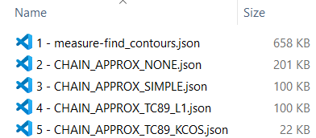

# Segmentations to COCO Annotation
When there are many files, it is recommended to write to the file every time a picture is processed

## Usage
### `seg2coco.py`
- `inst_dir`: The directory of instance segmentation images.  

- `sem_dir`: The directory of semantic segmentation images.

- `categories`: Assign category according to the value in semantic segmentation.
    > ```python 
    > categories = [
    >     {"id": 1, "name": "cube", "supercategory": "object"},
    >     {"id": 2, "name": "monkey", "supercategory": "object"},
    > ]  
    > ```

- `json_filepath`: Result annotations in json.

    #### Find Contours

    1. **`skimage.measure.find_contours`**: Highest accuracy, but takes up a lot of space. 


    2. **`cv2.findContours`**
    [Method Detail](https://vovkos.github.io/doxyrest-showcase/opencv/sphinx_rtd_theme/enum_cv_ContourApproximationModes.html#doxid-d3-dc0-group-imgproc-shape-1gga4303f45752694956374734a03c54d5ffaf7d9a3582d021d5dadcb0e37201a62f8)

        - `cv2.CHAIN_APPROX_NONE`: Second accuracy.
        
        - `cv2.CHAIN_APPROX_SIMPLE`: Third accuracy.
        
        - `cv2.CHAIN_APPROX_TC89_L1`: Fourth accuracy.
        
        - `cv2.CHAIN_APPROX_TC89_KCOS`: Lowest accuracy, but save space.
    
    
    <br />

### `show_anns.py`


