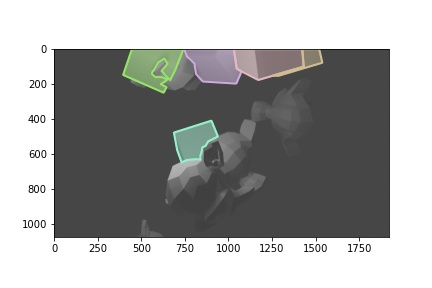
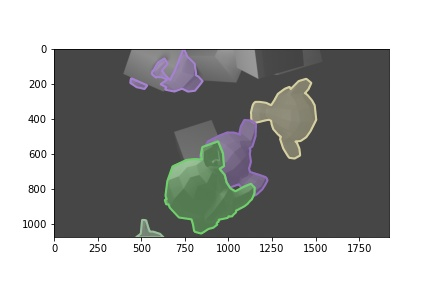

# Segmentations to COCO Annotation
When there are many files, it is recommended to write to the file every time a picture is processed

## Usage
### `seg2coco.py`
- `inst_dir`: The directory of instance segmentation images.  

- `sem_dir`: The directory of semantic segmentation images.

- `categories`: Assign category according to the value in semantic segmentation.
    > ```python 
    > categories = [
    >     {"id": 1, "name": "cube", "supercategory": "object"},
    >     {"id": 2, "name": "monkey", "supercategory": "object"},
    > ]  
    > ```

- `json_filepath`: Result annotations in json.

<br /> 

### `show_anns.py`


